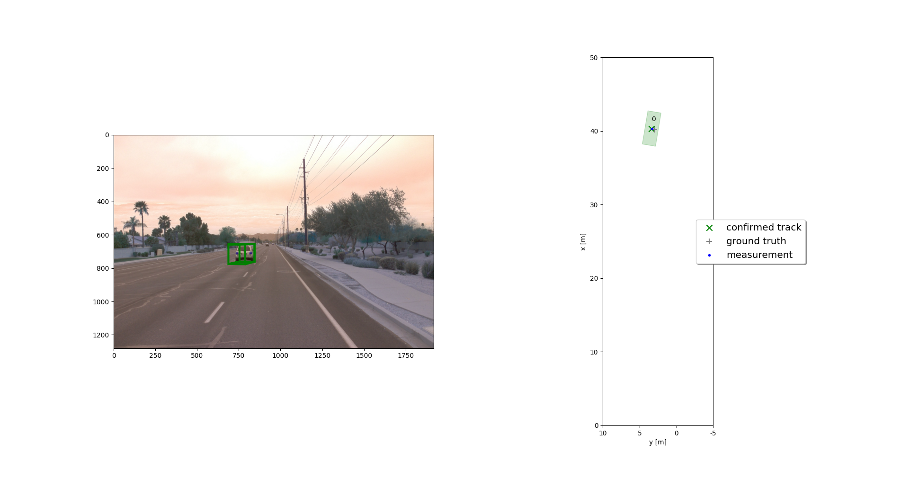
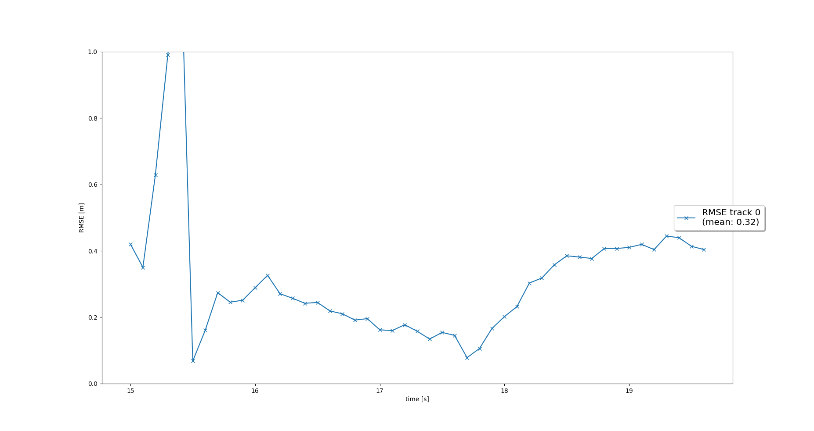
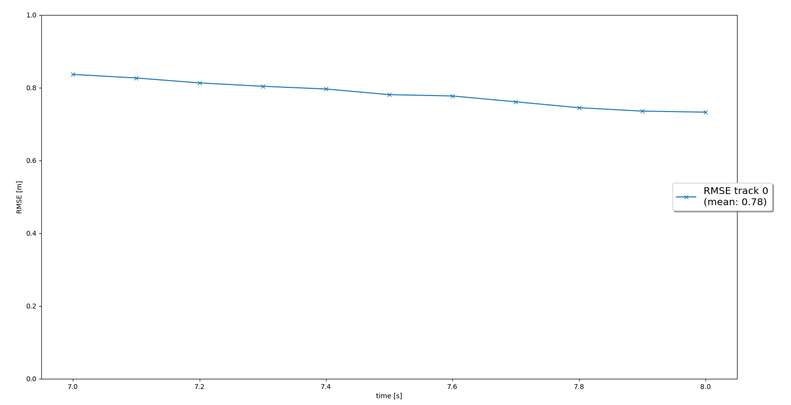
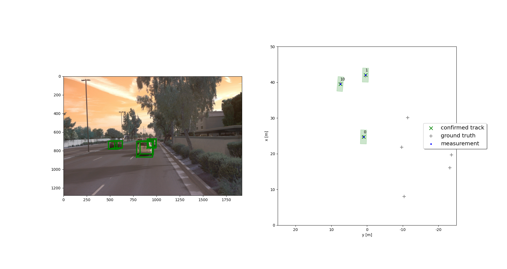
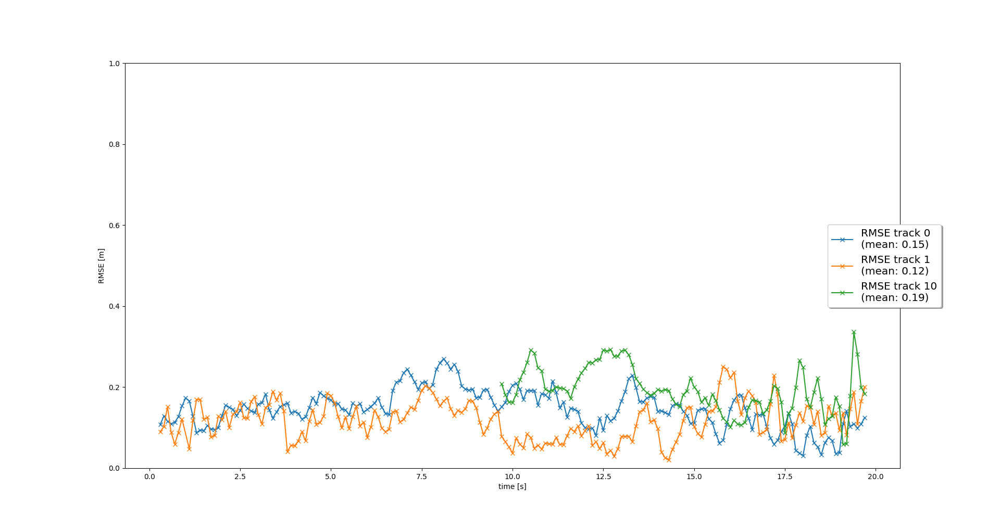
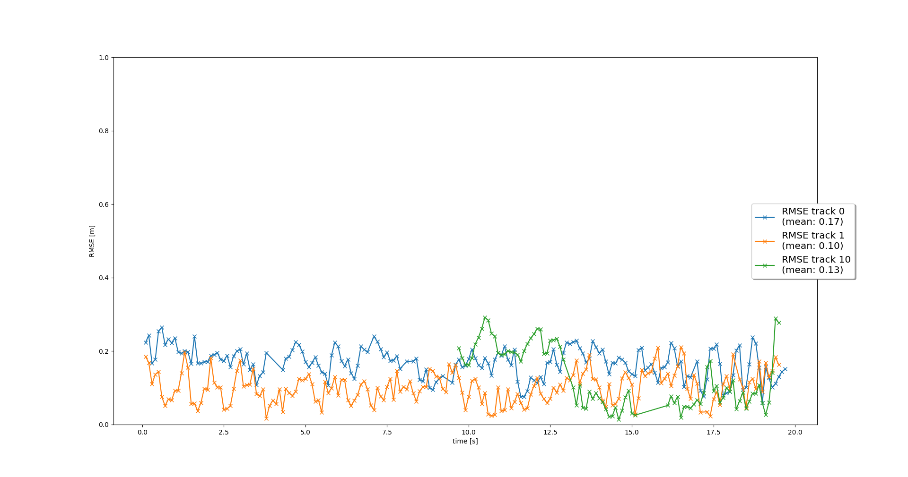

# Final Project: Sensor Fusion and Object Tracking

This final project of the Sensor fusion section of the Udacity Self Driving Car Engineer Nanodegree program consists of the following steps.

1. Implement an EKF to track a single real-world target with lidar measurement input over time
2. Implement the track management to initialize and delete tracks, set a track state and a track score.
3. Implement a single nearest neighbor data association to associate measurements to tracks
4. Implement the nonlinear camera measurement model.


It is enough to run the code below by making the changes specified in each step in the loop_over_dataset.py file.

```
python loop_over_dataset.py
```


## Section 1 : Tracking

Changes were made to the filter.py file to implement an EKF to track a single real-world target with lidar measurement input over time.

Perform the following steps in the loop_over_dataset.py file.

```
data_filename = 'training_segment-10072231702153043603_5725_000_5745_000_with_camera_labels.tfrecord'
show_only_frames = [150, 200]
configs_det = det.load_configs(model_name='fpn_resnet')
configs_det.lim_y = [-5, 10]
exec_detection = []
exec_tracking = ['perform_tracking']
exec_visualization = ['show_tracks']
```

EKF is applied to a simple single-target scenario with lidar only. The following steps were performed.

- Implement the F() and Q() functions to calculate a system matrix for constant velocity process model in 3D and the corresponding process noise covariance depending on the current timestep dt
- Predict state x and estimation error covariance P to next timestep
- Update state x and covariance P with associated measurement
- Calculate residual gamma
- Calculate covariance of residual S

Single target tracking results and the corresponding RMSE plot are shown below.


<p align="center">
 
</p>

The RMSE plot should show a mean RMSE of 0.35 or smaller. As seen in the chart, the Average RMSE is 0.32. 

<p align="center">
 
</p>


## Section 2 : Track Management


Changes were made to the trackmanagement.py file to implement the track management to initialize,update and delete tracks.

Perform the following steps in the loop_over_dataset.py file.


```
show_only_frames = [65, 100]
configs_det.lim_y = [-5, 15]
```

The following steps were performed to initialize, update and delete tracks.

- For a new track, the track score is initialized with 1/params.window ( params.window=0.6) and the track status is set to initialized. 
- Decrease the track score for unassigned tracks,
- Delete tracks if the score is lower than 0.6 or P is bigger than 9
- Increase track score, set track state to 'tentative'if track score is between 0.2 and 0.8 or 'confirmed'  if the score is over 0.8.

<p align="center">

</p>
<p align="center"></p>

There is one single track without track losses in between, so the RMSE plot should show a single line. 

## Section 3 : Data Association

Changes were made to the association.py file to associate measurements to tracks with nearest neighbor association.


Perform the following steps in the loop_over_dataset.py file.
```
data_filename = 'training_segment-1005081002024129653_5313_150_5333_150_with_camera_labels.tfrecord
show_only_frames = [0,200]
configs_det.lim_y = [-25, 25]
```

The following steps were performed

- Implemented a matrix with nearest neighbor data association
- Calculated the closest trace and measurement for association
- To reduce complexity, the chi-square distribution gating method was implemented. The gating threshold is set to 0.995
- Applied data association to a new sequence with multiple targets and updated multiple tracks with multiple measurements.
- There are no confirmed “ghost tracks” that do not exist in reality.
<p align="center">

</p>

<p align="center">

</p>


## Section 4 : Sensor Fusion

Changes were made to the measurements.py file to update all traces with lidar measurements then camera measurements

Perform the following steps in the loop_over_dataset.py.

```
exec_visualization = ['show_tracks', 'make_tracking_movie']
```
The following steps were performed

- Implemented camera measurements, including the appropriate covariance matrix R
- Implemented Nonlinear camera measurement model. Transformed position estimate from vehicle to camera coordinates, projected from camera to image coordinates
- The in_fov() function is implemented to control whether the input state vector of an object can be seen by this sensor. If the tracking status is in FOV(Field of View), then we can accept the meter-trace pair, otherwise we can reject it.

<p align="center">
 
</p>


<p align="center">

</p>

The visualization shows that the tracking is performing well, no confirmed ghost tracks or tracks loss should occur.


## Section 5: Evaluation and Conclusion
Track0 and track1 seen on the RMSE graph can be followed from the beginning of the sequence (0s - 200s) without loss of track. The average RMSE for these two paths is below 0.25. as expected.

### The most difficult part of the project
Ekf, track management, data association, and camera-lidar fusion are clearly understood in the lessons. However, the camera measuring model in the last section was difficult to implement, especially projecting 3D space into 2D space. However, the comments in the code files were instructive. In this way, I was able to overcome this problem.

### Benefits in camera-lidar fusion compared to lidar-only tracking 
As seen in this study, sensor fusion provides an advantage for stable tracking. Although images are obtained thanks to the point cloud structure created by Lidar, it is easier and more successful to work with CNN structures and detect objects over camera images. In addition, lidar can provide high performance in bad weather conditions. Using these two sensors together allows the other to complete the situation where one is missing, and also increases the performance. Therefore, sensor fusion is essential for self-drive cars.
### Challenges for sensor fusion system face in real-life scenarios
The camera is a passive sensor while the lidar is the active sensor. In other words, the lidar has its own light source, while the camera fully utilizes its external lighting. In an unlit environment, the camera will be completely blind and the lidar will be used alone. In this case, sensor fusion is not possible.

In addition, the sensors have a distance and field of view capability. It will not be able to detect objects in areas other than this.
### Ways to improve tracking results

- Parameters such as measurement noise standard deviation can be fine-tuned to achieve a lower RMSE. 
- As explained in the lectures, more advanced data association models can be applied.
- Results can be compared by using another model instead of the fpn_resnet model.

