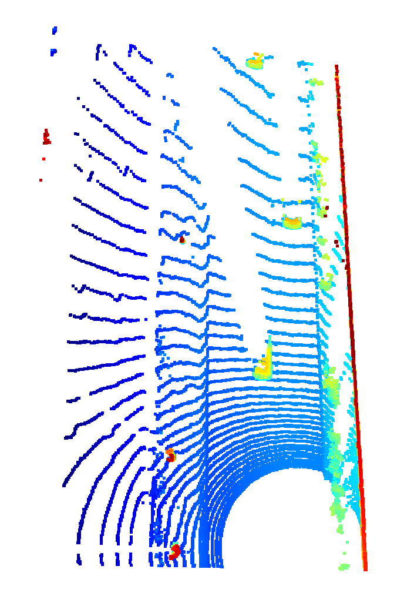
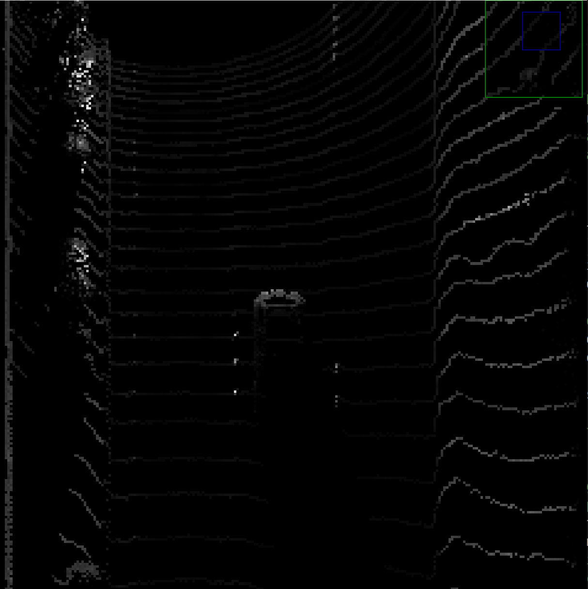
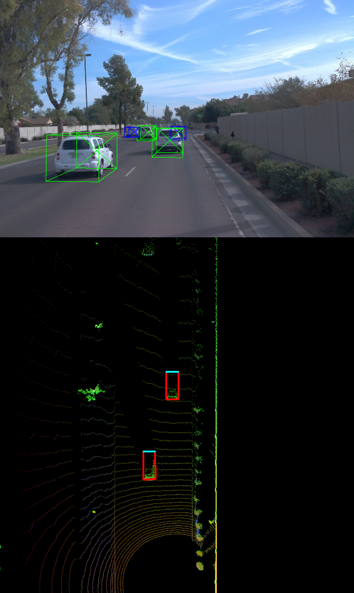
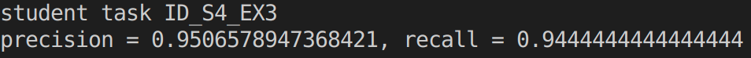
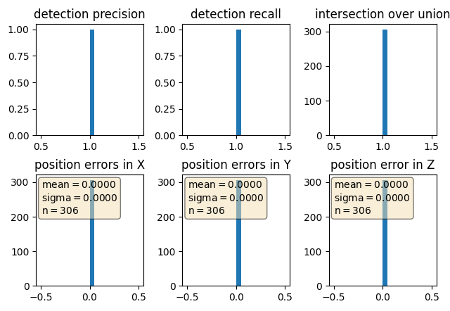

# Mid-Term Project: 3D Object Detection

This intermediate project of the Sensor fusion section of the Udacity Self Driving Car Engineer Nanodegree program consists of the following steps.

1. Compute Lidar Point-Cloud from Range Image
2. Create Birds-Eye View from Lidar PCL
3. Model-based Object Detection in BEV Image
4. Performance Evaluation for Object Detection

It is enough to run the code below by making the changes specified in each step in the loop_over_dataset.py file.

```
python loop_over_dataset.py
```


## Section 1 : Compute Lidar Point-Cloud from Range Image

In the Waymo Open dataset, lidar data is stored as a range image. Perform the following steps in the loop_over_dataset.py file to visualize the Range Image Sample.
```
data_filename = 'training_segment-1005081002024129653_5313_150_5333_150_with_camera_labels.tfrecord
show_only_frames = [0, 1]
exec_data = []
exec_detection = []
exec_tracking = []
exec_visualization = ['show_range_image']
```
<p align="center">
 Range Image Sample
</p>

The following steps were performed to convert Range Image to Lidar Point-Cloud.


- Convert range image “range” channel to 8bit
- Convert range image “intensity” channel to 8bit
- Crop range image to +/- 90 deg. left and right of the forward-facing x-axis
- Stack cropped range and intensity image vertically and visualize the result using OpenCV


Perform the following steps in the loop_over_dataset.py file to visualize the Point Cloud Sample.

```
data_filename = 'training_segment-1005081002024129653_5313_150_5333_150_with_camera_labels.tfrecord
show_only_frames = [0, 200]
exec_data = []
exec_detection = []
exec_tracking = []
exec_visualization = ['show_pcl']

```

| | |
|:---------------:|:---------------:|
| |  |
| |  |
| |  |
| |  |
| |  |

10 examples of vehicles with different visibility in point cloud are given above. The images on the left side show a far view of the point cloud from different degrees. The images on the right side show a close view of the point cloud from different degrees.  Visibile features changes when you look at the vehicles from close and far. The lidar point cloud shows the chassis of cars as the most identifiable feature. Stable features are largely trailer rear for trailer attached vehicles. When the vehicles are viewed from the side, mirrors and wheels can also be seen.


## Section 2 : Create Birds-Eye View from Lidar PCL
In order for the convolution operations to be applied efficiently, the point cloud representations should have a structure suitable for the needs of CNN.

In this section, we take the first step in creating a bird's eye (BEV) perspective of the lidar point cloud. Perform the following steps in the loop_over_dataset.py file to visualize the BEV Sample.

```
data_filename = 'training_segment-1005081002024129653_5313_150_5333_150_with_camera_labels.tfrecord
show_only_frames = [0, 1]
exec_data = ['pcl_from_rangeimage']
exec_detection = ['bev_from_pcl']
exec_tracking = []
exec_visualization = []
```

<p align="center">

</p>
<p align="center">Birds-Eye View Sample</p>

In this part,the "intensity" channel of the BEV map is filled with data from the point cloud. To do this, all points were defined with the same (x,y) coordinates within the BEV map, and then the intensity value of the upper lidar point was converted to the corresponding BEV pixel.
appointed. The effect of outliers (very bright and very dark regions) was weakened and objects of interest became distinguishable from the background.

<p align="center">
 Intensity Channel

In this part, the "height" channel of the BEV map is populated with data from the point cloud. To do this, the obtained lidar_pcl_top from the previous task was used and normalized the height in each BEV map pixel by the difference between max. and min. height which is defined in the configs structure.

<p align="center">
 Height Channel
</p>

## Section 3 : Model-based Object Detection in BEV Image

In this section, the following steps were performed to demonstrate how a new model can be integrated into an existing framework.

- Clone the repo [Super Fast and Accurate 3D Object Detection based on 3D LiDAR Point Clouds](https://github.com/maudzung/SFA3D)
- Extract the relevant parameters from SFA3D->test.py->parse_test_configs() and add them to the configs structure in load_configs_model.
- Instantiate the model for fpn_resnet in create_model.
- Convert the BEV to vehicle coordinates
- Convert the bounding box format to [class-id, x, y, z, h, w, l, yaw]

Perform the following steps in the loop_over_dataset.py file to visualize the 3D bounding boxes added to the images Sample.

```
data_filename = 'training_segment-1005081002024129653_5313_150_5333_150_with_camera_labels.tfrecord
show_only_frames = [50,51]
exec_data = ['pcl_from_rangeimage', 'load_image']
exec_detection = ['bev_from_pcl', 'detect_objects']
exec_tracking = []
exec_visualization = ['show_objects_in_bev_labels_in_camera']
configs_det = det.load_configs(model_name="fpn_resnet")
```

<p align="center">
 3D bounding boxes added to the images
</p>


# Section 4 : Performance Evaluation for Object Detection

In this section, we found matches between place-truth labels and detections so that we can determine whether an object was missed (false negative), successfully detected (true positive), or falsely reported (false positive).

The performance metrics are as follows.

<p align="left">
 
</p>

Perform the following steps in the loop_over_dataset.py file to visualize graphing performance metrics.
```
data_filename = 'training_segment-1005081002024129653_5313_150_5333_150_with_camera_labels.tfrecord
show_only_frames = [50,51]
exec_data = ['pcl_from_rangeimage']
exec_detection = ['bev_from_pcl', 'detect_objects', 'validate_object_labels', 'measure_detection_performance']
exec_tracking = []
exec_visualization = ['show_detection_performance']
configs_det = det.load_configs(model_name="darknet")
configs_det.use_labels_as_objects = False
```
<p align="center">
 
</p>
<p align="center">Graphing performance metrics</p>

When the configs_det.use_labels_as_objects parameter is set to True, the results are as follows.

<p align="center">

</p>
<p align="center">With the labels</p>

